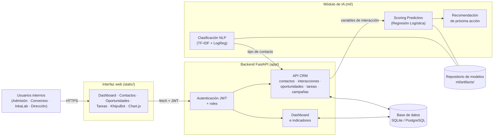
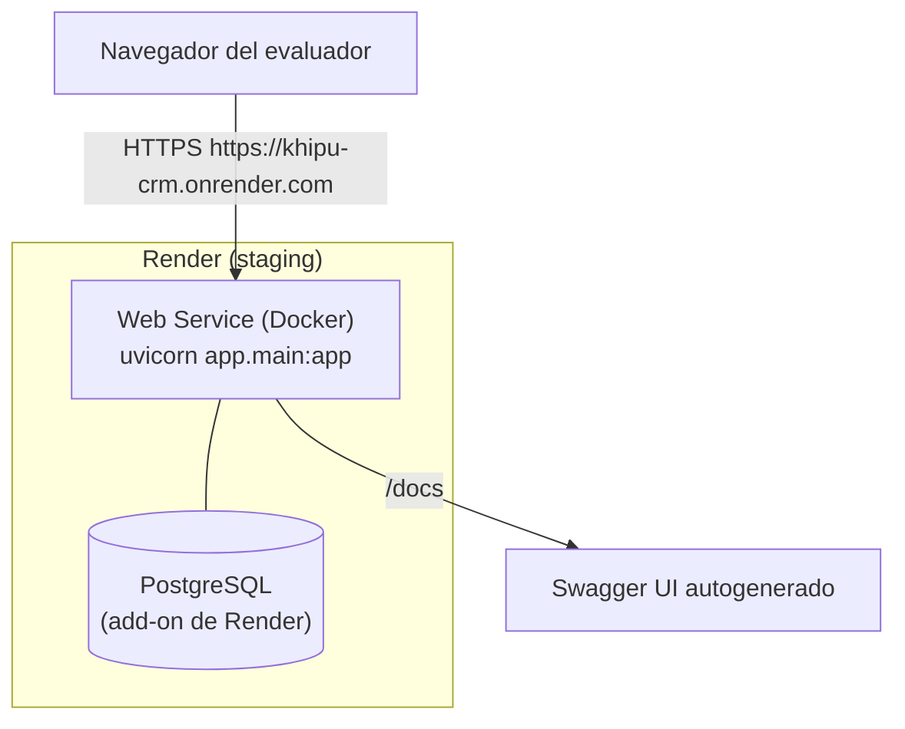

# 1. Arquitectura del sistema

## 1.1 Vista general

Aplicación web de tres capas con un módulo de IA desacoplado lógicamente:

**Flujo de información (RF01-RF03):**

1. El usuario inicia sesión y la interfaz guarda el JWT (login).
2. La interfaz consume los endpoints REST del CRM con el token.
3. Al calcular el score de una oportunidad, el backend arma las variables
   desde el historial real de interacciones y llama al modelo de ML.
4. El módulo de recomendación traduce el score en una próxima acción concreta.
5. KhipuBot clasifica mensajes entrantes (NLP) y puede crear contactos solos.
6. Las alertas detectan oportunidades con más de N días sin interacción.

## 1.2 Arquitectura lógica → física

| Módulo lógico (diseño) | Implementación física |
|---|---|
| Dashboard CRM (web) | `static/app.html` + JS vanilla + Chart.js, servida por FastAPI |
| API REST de gestión | FastAPI + SQLAlchemy (`app/routers/`) |
| Módulo Scoring ML | pipeline scikit-learn en `ml/`, artefacto `scoring_model.joblib` |
| Módulo NLP KhipuBot | TF-IDF + LogisticRegression, artefacto `nlp_model.joblib` |
| Módulo de recomendación | heurística sobre score + urgencia (`ml/service.py`) |
| Tareas y alertas | endpoints `/tareas` y `/alertas` (RF03) |
| Base de datos | SQLite en desarrollo; PostgreSQL vía `DATABASE_URL` en producción |
| Repositorio de modelos | `ml/artifacts/` (modelos + métricas JSON versionados en Git) |
| Autenticación/IAM | JWT HS256 + roles con jerarquía (`app/auth.py`) |

## 1.3 Justificación de las decisiones técnicas

- **FastAPI (único servicio):** las bases del curso exigen Flask o FastAPI para
  exponer el modelo. Se eligió FastAPI por traer Swagger/OpenAPI automático
  (entregable "endpoints documentados"), validación con Pydantic y rendimiento
  async. El CRM y la IA viven en capas separadas del mismo proceso: para el
  alcance académico esto cumple la separación lógica sin la complejidad de
  orquestar microservicios.
- **scikit-learn:** pipeline estándar (imputación → one-hot → escalado →
  clasificador). Se compararon Regresión Logística y Random Forest y se
  conservó el mejor por F1/ROC-AUC (ver métricas en el informe final).
- **PostgreSQL en producción / SQLite en desarrollo:** SQLAlchemy abstrae el
  motor; solo cambia `DATABASE_URL`. PostgreSQL garantiza integridad
  referencial y consultas complejas del embudo (como exige el diseño físico
  del documento de arquitectura del curso).
- **JWT + roles:** datos personales de postulantes y empresas →
  autenticación con token firmado y jerarquía lector < admisión < gestor <
  admin (RNF01).
- **Frontend sin framework:** las bases indican que la interfaz "no requiere
  diseño sofisticado"; JS vanilla + Chart.js cumplen la función con cero
  complejidad de build.
- **Rendimiento (RNF02):** el modelo se carga una sola vez (singleton con
  `lru_cache`); 100 scores se calculan en < 1 s (ver plan de pruebas).

## 1.4 Diagrama de despliegue

Alternativa local con contenedores: `docker compose up` (ver guía 07).
