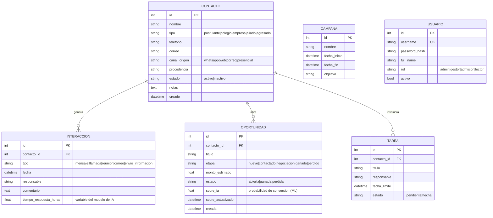

# 2. Modelo de datos

Implementado con SQLAlchemy en `app/models.py` (ORM). Motor: SQLite en
desarrollo, PostgreSQL en producción.

## 2.1 Diagrama entidad-relación

## 2.2 Relación con el modelo de IA

Las tablas transaccionales alimentan el modelo de scoring con las variables
definidas en la fase de preparación de datos:

| Variable del modelo | Origen en la base de datos |
|---|---|
| `tipo_contacto` | `contactos.tipo` |
| `canal_origen` | `contactos.canal_origen` |
| `etapa_embudo` | `oportunidades.etapa` |
| `num_interacciones` | `COUNT(interacciones)` del contacto |
| `tiempo_respuesta_promedio` | promedio de `interacciones.tiempo_respuesta_horas` |
| `dias_sin_interaccion` | hoy − fecha de la última interacción |
| `convertido` (target del entrenamiento) | etiqueta del histórico: se matriculó / firmó convenio |

## 2.3 Integridad

- Claves foráneas con borrado en cascada desde contacto (sus interacciones y
  oportunidades se eliminan con él).
- Campos categóricos restringidos por validación Pydantic (ver schemas) —
  la base solo recibe valores del dominio permitido.
